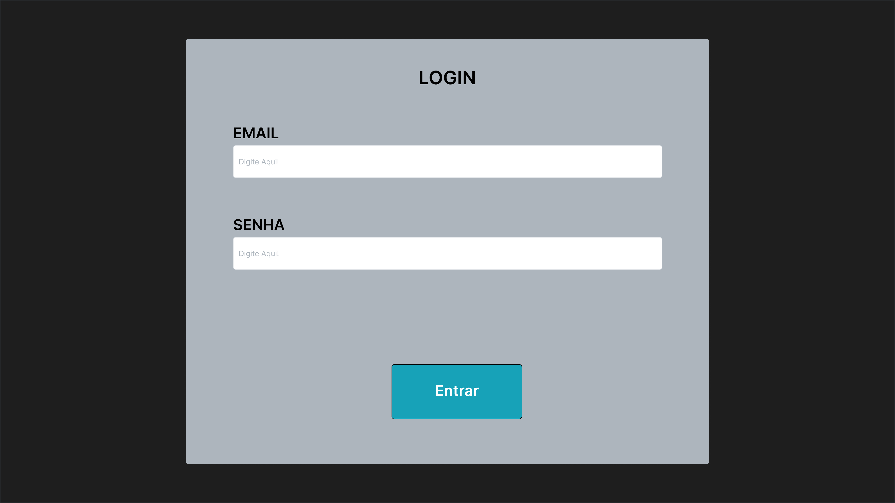
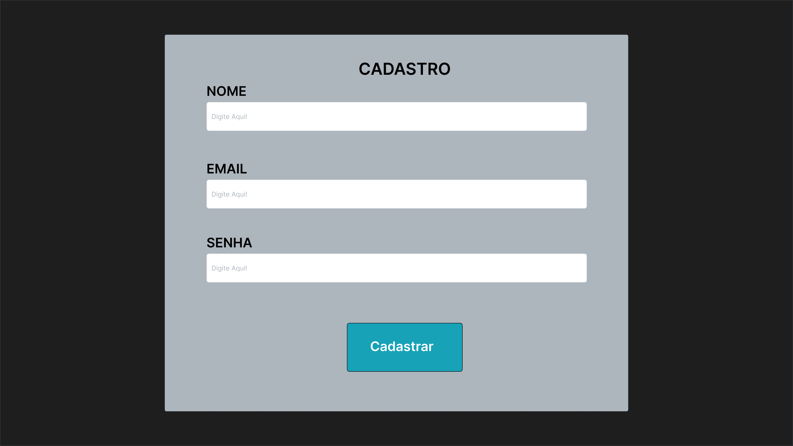
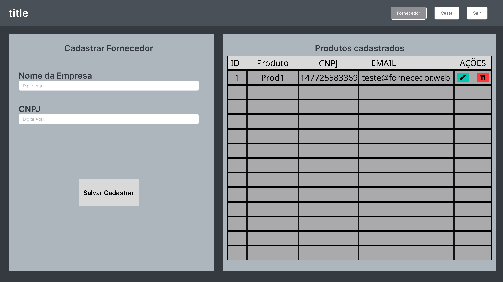
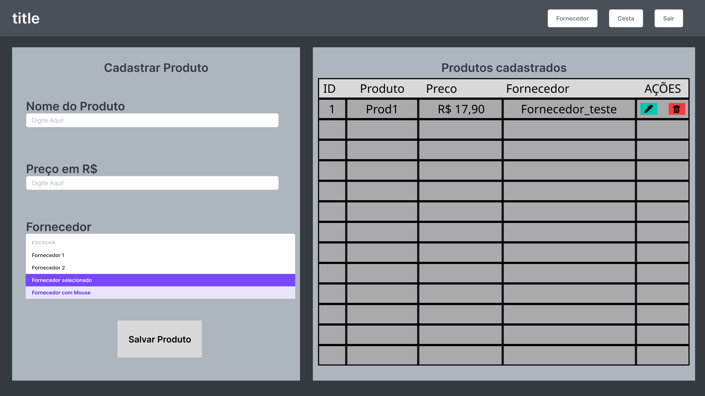
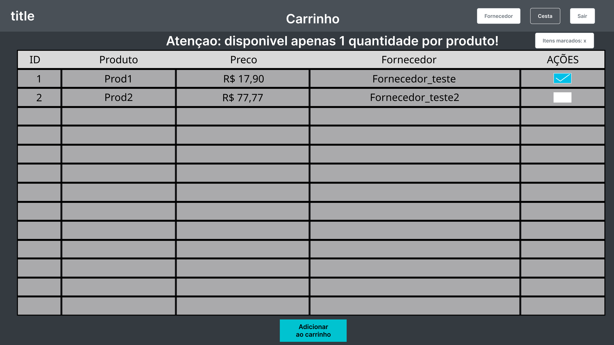
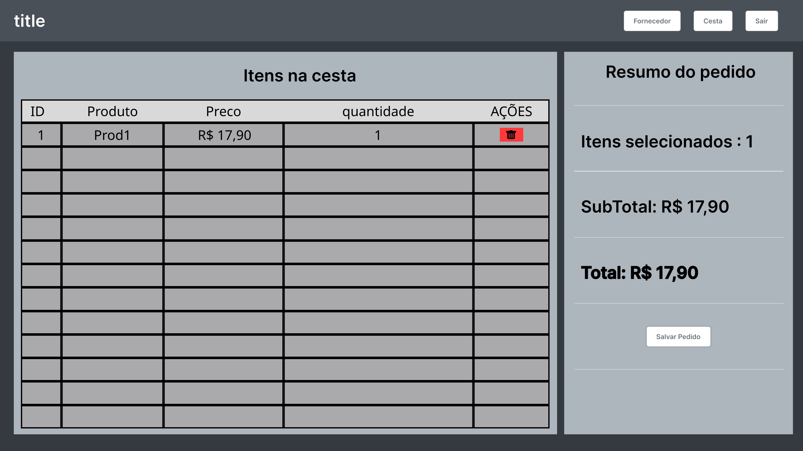

# 🛒 Supermercado Amizade
Sistema web para controle de estoque, fornecedores e simulação de compras, desenvolvido com arquitetura MVC simples em PHP e integração assíncrona via AJAX.
---
## etapa 1 - Os protótipos de interface foram criados no figma seguindo alguns padrões de Bootstrap
### 1. Autenticação (Cadastro e Login)

### 2. Gerenciamento de Fornecedores

### 3. Gerenciamento de Produto

### 4. Catálogo de Produtos (Carrinho)

### 5. Resumo de Compra (Cesta)

> **link do projeto no figma:** [acesse o projeto das telas no figma](https://www.figma.com/design/pzLFK7CatI35ZIh3nl2f3F/CRUD?node-id=27-267&t=pPuQYXWWJSlNTSU0-1)
---
## etapa 2 - Sobre o Sistema

### 🚀 Tecnologias Utilizadas

- **Front-end:** HTML5, CSS3, JavaScript (Fetch API), Bootstrap 5
- **Back-end:** PHP (PDO)
- **Banco de Dados:** MySQL / MariaDB
- **Design:** Figma

---

### ⚙️ Funcionalidades

- **Autenticação:** Sistema de login, cadastro de usuários e encerramento seguro de sessão.
- **Gestão de Fornecedores:** CRUD completo (cadastro, listagem, edição e exclusão).
- **Gestão de Produtos:** CRUD completo com tratamento de integridade referencial (chaves estrangeiras).
- **Catálogo de Produtos:** Visualização dinâmica dos itens disponíveis vinculados aos seus fornecedores.
- **Cesta de Compras:**
  - Adição múltipla de itens diretamente do catálogo.
  - Cálculo automático do valor total.
  - Remoção de itens individuais ou esvaziamento da cesta.
  - Fluxo de finalização de pedido (checkout).

---

### 👥 Autores

- **Leonardo de Oliveira Barboza** - [GitHub](https://github.com/leonardobarboza7) - RA: 60006347
- **Gustavo Henrique Espadrizano Francisco.** - [GitHub](https://github.com/GustavoF-PR) - RA: 60006470

Projeto desenvolvido para a disciplina de **Desenvolvimento de Aplicações para WEB I** do curso de Sistemas de Informação.
